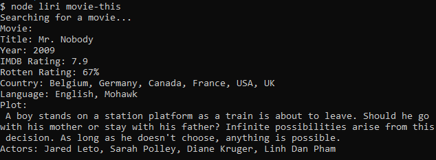

# LIRI
## Language Interpretation and Recognition Interface - Week 10 Homework

### Search using very specific APIs to log info to the console and to a log.txt file.

## Features

Search for concerts by artist.  
Search for songs on spotify.  
Search for info on movies.  
Parse a text file for commands.  

## Setup

In order to run LIRI on your machine you must provide a .env file.  
The .env file should contain your API keys like so:  
```
SPOTIFY_ID=#######
SPOTIFY_SECRET=######

BANDSINTOWN=#######
```

You can also edit the random.txt file. Make sure to format it like so:  
_command_**,**_search term_

## Using LIRI

Possible commands:

- concert-this <artist>  
 Searches BandsInTown for the next concert available for the artist provided.
  
- spotify-this-song <song title>  
Searches Spotify for info on the song title provided. If no song title is provided, LIRI will search Spotify for 'The Sign'.
  
- movie-this <movie title>  
Searches OMDB for info on the movie provided. If no movie title is provided, LIRI will search OMDB for 'Mr Nobody'.  
  
- do-what-it-says  
Will parse the random.txt file for a command and search term.

# Examples




